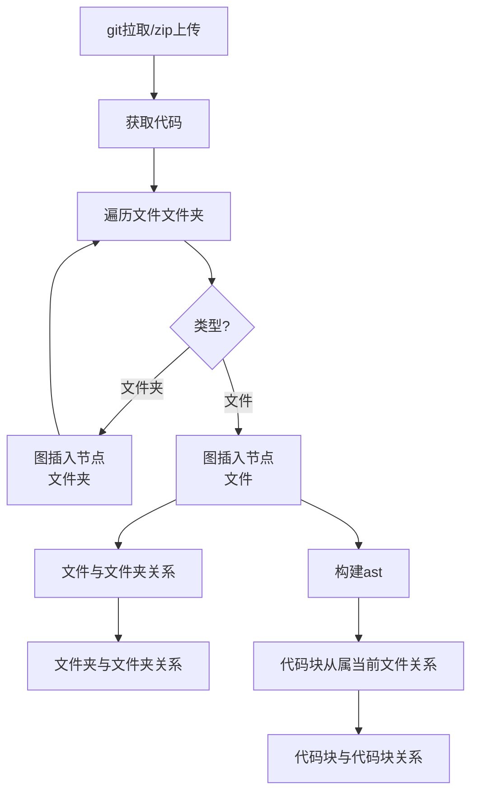

# graphRAG流程

节点:
- 文件夹
- 文件
- 类
- 函数

边:
- 文件夹包含文件夹
- 文件夹包含文件(最大代码块)
- 代码块AST关系(多种多层 TODO)

## 流程图

### todo

- [ ] 代码块链添加子类子函数迭代 (多语言慢慢丰富)
- [ ] 代码块与代码块关系 (多语言慢慢丰富)
- [x] 代码块从属当前文件关系
- [x] 文件夹与文件夹关系
- [x] 文件与文件夹关系
- [ ] class属性和局部属性
- [ ] file import

### design

按文件结构建 图  实际节点

+部分按纯调用关系建

按纯调用关系建 图   虚拟节点

!!! 最后问题不好  相应级别的代码块加提示

<!-- 图 -->
构建真实节点和关系

单层关联抽取节点解释

抽取虚拟节点(业务模块等)

