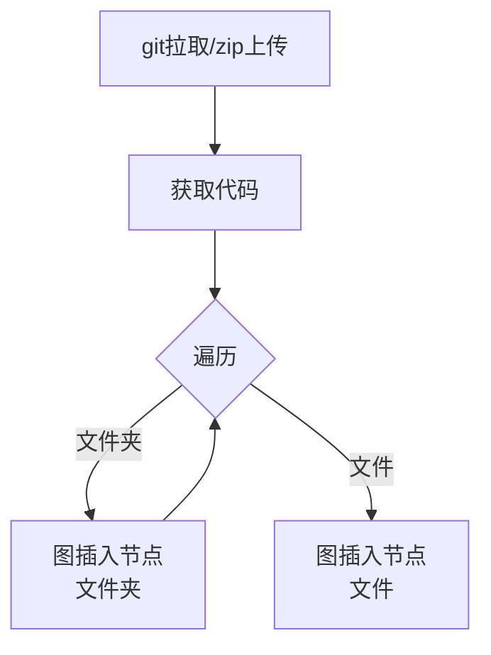

# graphRAG流程

节点:
- 文件夹
- 文件
- 类
- 函数

边:
- 文件夹包含文件夹
- 文件夹包含文件(最大代码块)
- 代码块AST关系(多种多层 TODO)

## 流程图

```mermaid
graph TD;
    A[git拉取/zip上传] 
    -->B[获取代码]
    --> C{遍历};
    C --> |文件夹| D[图插入节点
    文件夹]--> C{遍历};
    C --> |文件| E[
        图插入节点
        文件
        ]
```